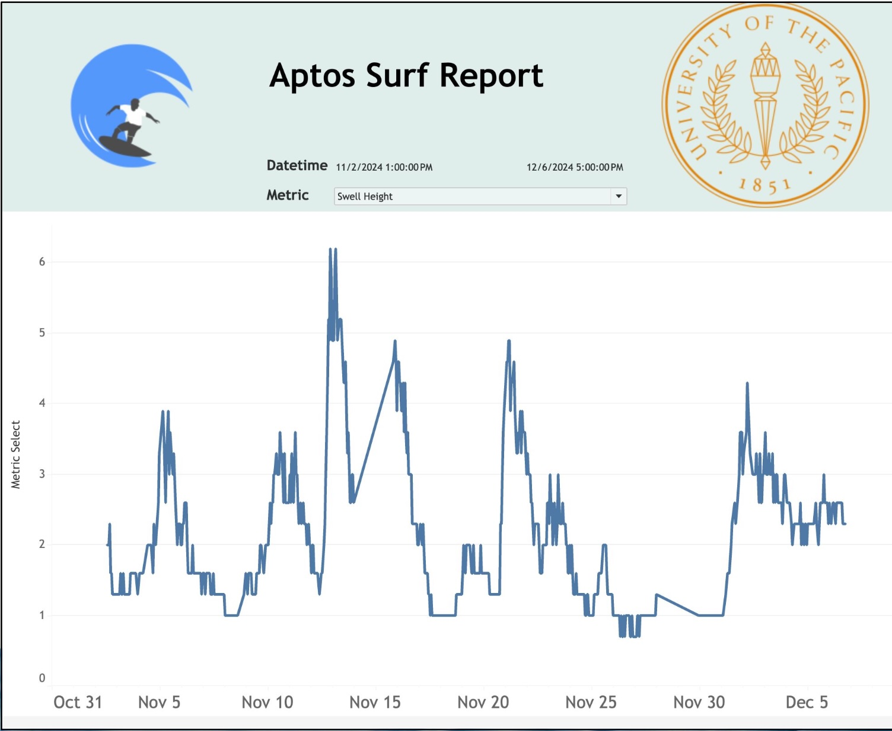

# Data Engineering Surf Report
The goal of this data engineering project is to automate the process of extracting, transforming, and loading (ETL) buoy data from hourly text files into a centralized SQL database, using Amazon S3 as an intermediate staging area. The final output will enable efficient storage, analysis, and visualization of historical buoy data for decision-making and insights.

### Pipeline Architecture

  1. Extract buoy data from text files gathered hourly from the NBDC API
  2. Transform new data into a csv file of daily buoy data
  3. Upload the daily buoy csv file into Amazon S3 bucket as a staging area
  4. Load the csv daily into a SQL database
  5. Use presentation and analysis tools to visualize and analyze historical buoy data

### Example Report
https://public.tableau.com/app/profile/ethan.panal2466/viz/AptosSurfReport/AptosSurfReport?publish=yes

